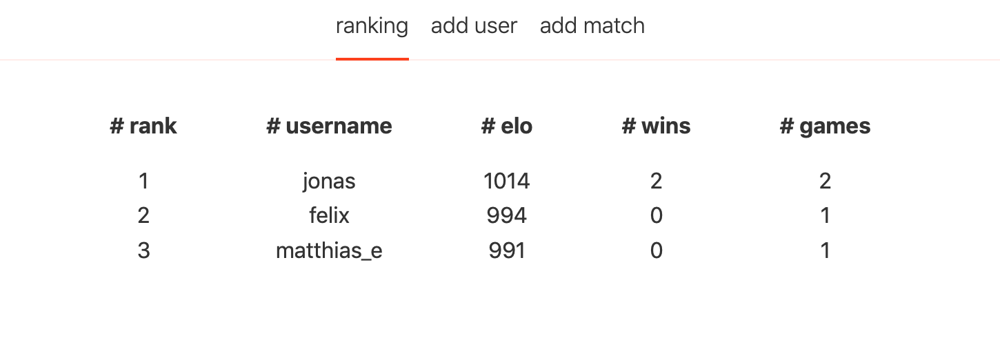
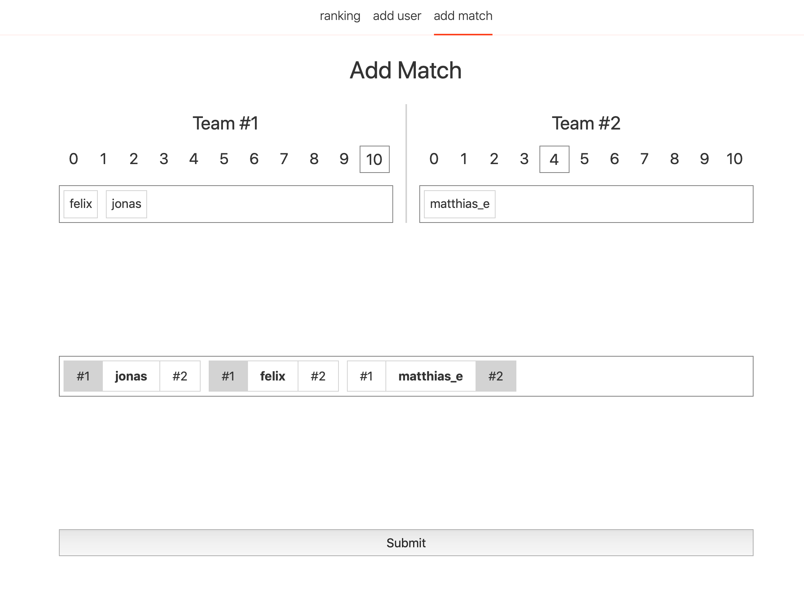
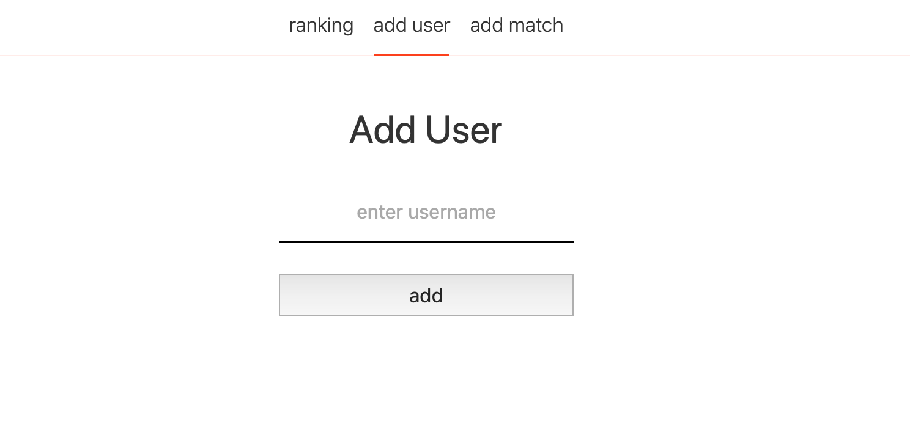

# elo-hell

this project tracks kicker scores.

it is made using [svelte](https://svelte.dev) with [sapper](https://sapper.svelte.dev).

layouted by [everylayout svelte components](https://github.com/SilvanCodes/svelte-layout-components).

## screenshots

### ranking

### add match

### add user

